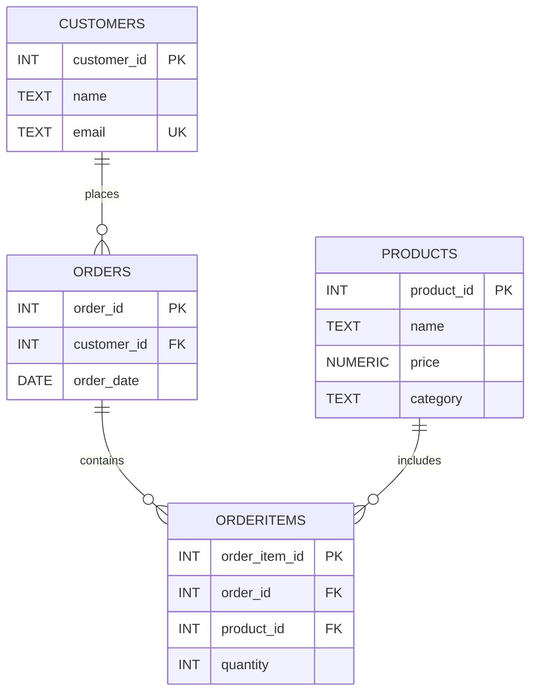

# Bonga Ecommerce Data Pipeline

This project loads ecommerce CSV datasets into PostgreSQL using a repeatable pipeline.

## What You Get

- Dockerized PostgreSQL for consistent local setup
- SQL-based schema creation with constraints and indexes
- Idempotent data loading (safe to re-run)
- Validation checks for row counts and foreign keys
- CI pipeline with GitHub Actions for automated load tests

## Project Structure

- `data/raw/*.csv`: source datasets (`products`, `customers`, `orders`, `orderitems`)
- `sql/01_schema.sql`: creates tables and indexes
- `sql/02_load_data.sql`: truncates and reloads data from CSV
- `sql/03_validate.sql`: verifies row counts and referential integrity
- `sql/legacy/ddl.sql`: original starter DDL script
- `scripts/run_pipeline.sh`: one-command local pipeline runner
- `docker-compose.yml`: local PostgreSQL service
- `.github/workflows/load-data-pipeline.yml`: CI pipeline
- `docs/images/`: reference screenshots and assets

## Entity Relationship Diagram (ERD)

## Prerequisites

- Docker Desktop (running)
- Bash shell (macOS already has it)

## Quick Start (3 steps)

1. Create environment file:

Development:

`make setup-dev`

Production-like profile:

`make setup-prod`

2. Open `.env.dev` or `.env.production` and set a strong password for `POSTGRES_PASSWORD`.

3. Run full pipeline:

Development:

`make pipeline-dev`

Production-like profile:

`make pipeline-prod`

You should see final output: `[DONE] Pipeline completed successfully`.

## Useful Commands

- Start database only: `make up ENV=.env.dev`
- Run full load + validation: `make pipeline-dev`
- Stream DB logs: `make logs ENV=.env.dev`
- Stop database: `make down ENV=.env.dev`

Dev profile note: `.env.dev` uses host port `55432` to avoid collisions with a local PostgreSQL service.

Production-like profile note: `.env.production` uses host port `55433` to avoid collisions with other local services.

## Local Query Execution

- Full local guide: `docs/local-run.md`
- Query solutions (markdown): `docs/solutions.md`
- Query solutions (runnable SQL): `docs/solutions.sql`

## Production Readiness Notes

- Pipeline is idempotent: every run recreates table contents in a clean order.
- Constraints and foreign keys prevent bad data from loading silently.
- Validation query checks for orphans after every load.
- CI workflow ensures schema/load/validation works on every PR or push.

## GitHub Actions Secrets

Set these repository secrets before running the GitHub Actions pipeline:

- `CI_POSTGRES_DB`
- `CI_POSTGRES_USER`
- `CI_POSTGRES_PASSWORD`

Recommended values:

- `CI_POSTGRES_DB=bongadb`
- `CI_POSTGRES_USER=bonga_admin`
- `CI_POSTGRES_PASSWORD=<strong_password>`

## Data Exposure Policy

- Files in `data/raw/` are synthetic demo datasets and are safe to keep in GitHub.
- Never commit real customer data, sensitive business data, secrets, or PII.
- Put private datasets in `data/private/` (ignored by git) or in secure cloud storage.
- Keep repository datasets small and focused on reproducible testing/training use cases.

## Cloud Storage Integration

To use production datasets without committing sensitive data to Git:

- **[Cloud Storage Setup Guide](docs/cloud-storage-setup.md)**: Integrate AWS S3, Azure Blob, or GCS
- Automatically fetch CSV files in CI/CD pipelines
- Local development with `.env.storage` configuration
- Support for AWS S3, Azure Blob Storage, and Google Cloud Storage

## Common Troubleshooting

- Error: password authentication failed
  - Check `.env` values and rerun `make down && make up && make load`

- Error: CSV file not found
  - Ensure CSV files exist under `data/raw/`

- Port 5432 already in use
  - Change `POSTGRES_PORT` in `.env` to another port (for example 5433)
